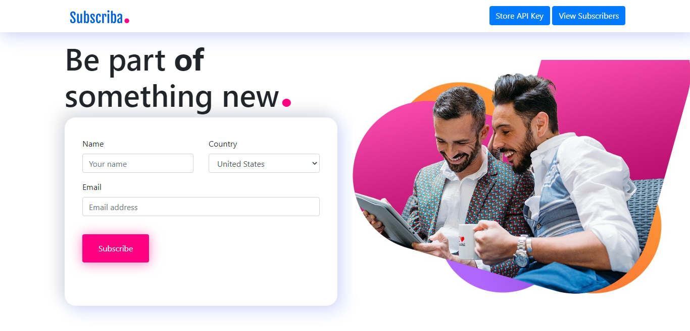
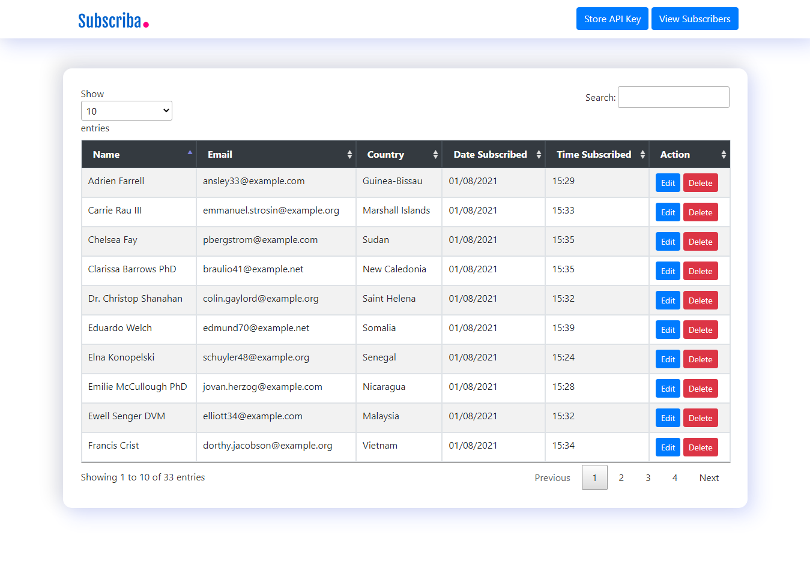

A simple and robust interface, powered by the MailerLite API to manage your mailing list. Designed to be simple, intuitive and easy to use. 

## How to Use
- Create an account on [MailerLite](https://mailerlite.com), and get an API Key
- Clone the repo  `git clone https://github.com/Monamoxie/subscriba-with-mailer-lite.git`
- After that, cd into cloned directory `cd subscriba-with-mailer-lite`
- Copy env with `cp .env.example .env`
- And install all composer dependencies with `composer install`
- Also install npm dependencies with `npm install`
- Run `php artisan key:generate` to set up an encryption key for the project
- Create your database if you don't have one yet and remember to update .env file with the correct details
- If you wish to use the  default migrations, run `php artisan migrate` or import the sql file in the root folder called  `subscriba.sql` into your database
- Then run `php artisan serve` to fire up a development server for your project

If you encounter any NODE related issues `ERR_OSSL_EVP_UNSUPPORTED`, when running npm commands, run 
# linux
export NODE_OPTIONS=--openssl-legacy-provider
# windows
set NODE_OPTIONS=--openssl-legacy-provider

## TODO
- An authentication layer to secure access
- Advanced user management with the MailerLite service
- Manage multiple api keys

### TECH STACK

- PHP
- Laravel
- Javascript
- Vuejs
- JQuery
- Nginx

## Credit
- Mozilla Firefox (Image Banner)
- Button Effect (https://codepen.io/nourabusoud)

## DEMO LINK
https://subscriba.herokuapp.com/

## License

Subscriba is open-sourced and licensed under the [MIT license](https://opensource.org/licenses/MIT).
